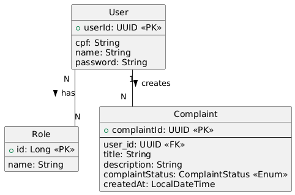

# Reclame Ali Backend

## Visão Geral do Projeto

O "Reclame Ali Backend" é uma aplicação Java Spring Boot desenvolvida para gerenciar reclamações de usuários. Ele oferece uma API robusta para registro de usuários, autenticação e o ciclo de vida completo das reclamações (criação, listagem, visualização de detalhes, atualização e exclusão). Este backend serve como a base para um sistema de gerenciamento de reclamações, destinado a ser consumido por uma aplicação frontend separada (por exemplo, construída com React).

## Decisões Arquiteturais

Este projeto segue uma **arquitetura monolítica** com forte ênfase na **inversão de dependências**, promovendo uma base de código desacoplada e de fácil manutenção. As principais decisões arquiteturais incluem:

*   **Spring Boot:** Utilizado para desenvolvimento rápido de aplicações, gerenciamento de dependências e convenção sobre configuração.
*   **Arquitetura em Camadas:** A aplicação é estruturada em camadas distintas:
    *   **Camada de API:** Lida com requisições HTTP, DTOs e expõe a funcionalidade da aplicação.
    *   **Camada de Aplicação:** Contém a lógica de negócio e orquestra operações, atuando como uma interface entre a API e as camadas de domínio/infraestrutura.
    *   **Camada de Domínio:** Encapsula as regras de negócio e entidades centrais, independentemente de persistência ou preocupações externas.
    *   **Camada de Infraestrutura:** Gerencia preocupações externas como interações com o banco de dados (JPA/Hibernate), segurança (Spring Security, JWT) e outras implementações técnicas.
*   **Padrão CQRS-like (para Reclamações):** Embora não seja uma implementação CQRS completa, o módulo de reclamações separa as operações de comando (criar, atualizar, excluir) e consulta (obter, listar), promovendo responsabilidades mais claras e potencial para escalabilidade independente.
*   **Autenticação JWT:** JSON Web Tokens são usados para autenticação e autorização seguras, fornecendo um mecanismo stateless para sessões de usuário.
*   **Tratamento de Exceções:** O tratamento centralizado de exceções é implementado para fornecer respostas de erro consistentes e informativas.

## Estrutura de Pastas

O código-fonte Java principal está organizado em `src/main/java/com/marckvsv/reclame_ali_backend`. Abaixo está um detalhamento dos principais pacotes:

```
src/
└── main/
    └── java/
        └── com/
            └── marckvsv/
                └── reclame_ali_backend/
                    ├── ReclameAliBackendApplication.java  // Ponto de entrada principal da aplicação Spring Boot
                    ├── administration/                   // Módulo de administração de usuários (registro, login)
                    │   ├── api/                          // Controladores REST, DTOs, comandos para administração
                    │   │   ├── command/
                    │   │   ├── dto/
                    │   │   └── ...
                    │   ├── application/                  // Lógica de negócio para gerenciamento de usuários
                    │   ├── domain/                       // Entidades de domínio de usuário (se houver lógica de domínio específica)
                    │   └── infrastructure/               // Persistência (repositórios JPA), configurações de segurança
                    │       ├── models/                   // Entidades JPA (User, Role)
                    │       ├── repository/
                    │       └── security/                 // Configuração do Spring Security, filtros JWT, UserDetails
                    ├── complaints/                       // Módulo de gerenciamento de reclamações
                    │   ├── api/                          // Controladores REST, DTOs, comandos/consultas para reclamações
                    │   │   ├── cqrs/
                    │   │   │   ├── commands/
                    │   │   │   └── query/
                    │   │   ├── dto/
                    │   │   └── ...
                    │   ├── application/                  // Lógica de negócio para gerenciamento de reclamações
                    │   ├── domain/                       // Entidades de domínio de reclamação (DomainComplaint)
                    │   └── infrastructure/               // Persistência (repositórios JPA), exceções personalizadas
                    │       ├── exceptions/
                    │       ├── model/                    // Entidade JPA (Complaint)
                    │       └── repository/
                    └── sharedKernel/                     // Utilitários comuns e componentes compartilhados
                        ├── application/                  // Utilitário JWT, comandos/consultas base, exceções comuns
                        │   ├── command/
                        │   ├── exceptions/
                        │   └── query/
                        └── domain/                       // Enums de domínio compartilhados (ex: ComplaintStatus)
```

## Diagrama DER



## Endpoints da API

A API é versionada com `/api/v1`.

### Administração de Usuários (`/api/v1/administration`)

*   **`POST /api/v1/administration/signup`**
    *   **Descrição:** Registra uma nova conta de usuário.
    *   **Corpo da Requisição:** `CreateAccountRequest` (JSON)
        ```json
        {
          "name": "John Doe",
          "cpf": "12345678900",
          "password": "securepassword"
        }
        ```
    *   **Resposta:** `201 Created` (Sem conteúdo)

*   **`POST /api/v1/administration/signin`**
    *   **Descrição:** Autentica um usuário e retorna um token JWT.
    *   **Corpo da Requisição:** `LoginRequest` (JSON)
        ```json
        {
          "cpf": "12345678900",
          "password": "securepassword"
        }
        ```
    *   **Resposta:** `200 OK` com `AuthenticationResponse` (JSON)
        ```json
        {
          "token": "eyJhbGciOiJIUzUxMiJ9.eyJzdWIiOiJmYmMyODljMS04ZDRiLTQyZGItYmMyYy1iY2Y3OWIyZTJlYmMiLCJ1c2VySW5mbyI6eyJuYW1lIjoiSm9obiBEb2UifSwiaWF0IjoxNzA1MjYwMDAwLCJleHAiOjE3MDUyODg4MDB9.signature"
        }
        ```

### Gerenciamento de Reclamações (`/api/v1/complaint`)

**Autenticação:** Todos os endpoints de reclamação exigem um JWT válido no cabeçalho `Authorization` (ex: `Bearer <seu_jwt_token>`).

*   **`POST /api/v1/complaint`**
    *   **Descrição:** Cria uma nova reclamação.
    *   **Corpo da Requisição:** `CreateComplaintRequest` (JSON)
        ```json
        {
          "title": "Defeito no Produto",
          "description": "O produto que recebi apresenta um grande defeito em sua funcionalidade."
        }
        ```
    *   **Resposta:** `200 OK` (Sem conteúdo)

*   **`GET /api/v1/complaint/summary`**
    *   **Descrição:** Recupera um resumo paginado das reclamações para o usuário autenticado.
    *   **Parâmetros de Consulta:**
        *   `page` (opcional, padrão: 0): O número da página a ser recuperada.
        *   `size` (opcional, padrão: 10): O número de itens por página.
    *   **Resposta:** `200 OK` com `Page<ComplaintResponse>` (JSON)

*   **`GET /api/v1/complaint/{id}`**
    *   **Descrição:** Recupera os detalhes de uma reclamação específica pelo seu UUID.
    *   **Variável de Caminho:** `id` (UUID da reclamação)
    *   **Resposta:** `200 OK` com `ComplaintResponse` (JSON)

*   **`PATCH /api/v1/complaint/{uuid}`**
    *   **Descrição:** Atualiza uma reclamação existente. Apenas reclamações com status `PENDENTE` podem ser atualizadas.
    *   **Variável de Caminho:** `uuid` (UUID da reclamação)
    *   **Corpo da Requisição:** `UpdateComplaintRequest` (JSON)
        ```json
        {
          "title": "Título Atualizado",
          "description": "Descrição atualizada da reclamação.",
          "complaintStatus": "RESOLVIDO"
        }
        ```
    *   **Resposta:** `200 OK` com `ComplaintResponse` (JSON)

*   **`DELETE /api/v1/complaint/{uuid}`**
    *   **Descrição:** Exclui uma reclamação. Apenas reclamações com status `PENDENTE` podem ser excluídas.
    *   **Variável de Caminho:** `uuid` (UUID da reclamação)
    *   **Resposta:** `200 OK` (Sem conteúdo)

## Configuração e Execução

1.  **Pré-requisitos:**
    *   Java 24
    *   Maven
    *   Banco de dados MySQL/PostgreSQL (configurado em `application.properties`)

2.  **Configuração do Banco de Dados:**
    *   Atualize `src/main/resources/application.properties` com os detalhes da sua conexão de banco de dados:
        ```properties
        spring.datasource.url=jdbc:mysql://localhost:3306/complaints_app
        spring.datasource.username=root
        spring.datasource.password=sua_senha_do_banco_de_dados
        spring.jpa.hibernate.ddl-auto=update # Ou 'create' para configuração inicial
        ```

3.  **Construir o Projeto:**
    ```bash
    ./mvnw clean install
    ```

4.  **Executar a Aplicação:**
    ```bash
    ./mvnw spring-boot:run
    ```

A aplicação será iniciada na porta 8080 por padrão.